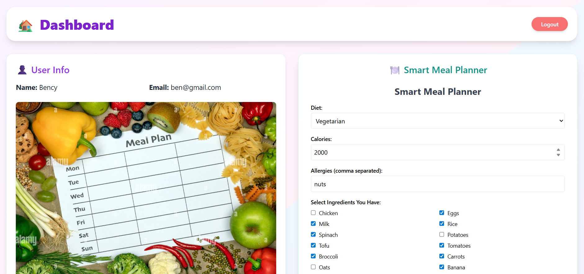
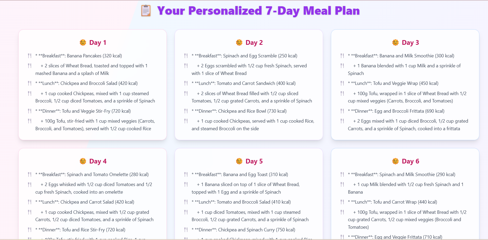

# 🍽️ MealMind – Smart Diet & Meal Plan Generator

MealMind is an AI-powered MERN stack website that generates personalized weekly meal plans based on your dietary preferences, allergies, calorie goals, and even ingredients you already have. With real-time nutrition data and a beautiful responsive dashboard, it helps you stay healthy, save time, and reduce food waste.

## 🌟 Features

- 🧠 AI-generated weekly meal plans using [Groq's LLaMA3-70B](https://groq.com/)
- 🍏 Nutrition info from Spoonacular API (calories, protein, fat, carbs)
- ✅ Supports vegetarian, vegan, keto, and more
- 🔍 Ingredient checklist and custom input
- 📱 Fully responsive dashboard UI with Tailwind CSS
- 🔐 JWT authentication (login/signup)

## 🔧 Tech Stack

| Frontend | Backend | AI & APIs |
|---------|---------|-----------|
| React + TypeScript | Node.js + Express | Groq LLaMA3-70B |
| Vite | MongoDB Atlas | Spoonacular API |
| Tailwind CSS v4 | JWT Auth |  |

## 🚀 Getting Started

### 📦 Clone the repo

```bash
git clone https://github.com/delma2003/mealmind.git
cd mealmind
🖥️ Backend Setup
bash


cd backend
npm install
npm run dev
🌐 Frontend Setup
bash


cd frontend
npm install
npm run dev
⚙️ Environment Variables
Create a .env in /backend:

env


GROQ_API_KEY=your_groq_api_key
SPOONACULAR_API_KEY=your_spoonacular_key
JWT_SECRET=your_jwt_secret
MONGO_URI=your_mongo_uri
📸 Screenshots
### 🧑‍💻 Register


### 🏠 Dashboard


### 🔐 Login Page


### 🍽️ Generated Meal Plan



📜 License
MIT

Made with ❤️ by Delma Johnson